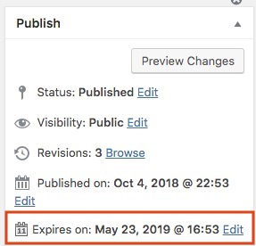

# Expiring Posts
This plugin adds functionality to expire a post on a given date.

It does this by adding a new "Expires" date field in the Publish box. 

By default a post never expires:

But you can add a date instead:

Once that date is reached, the post is marked as expired and is no longer visible to the end user.

### Dev Notes
* the new post status is `expired`
* a filter called `exp_disable_expiration_for_this_post` exists to disable this feature on a per-post basis.
